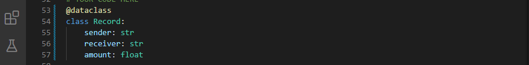
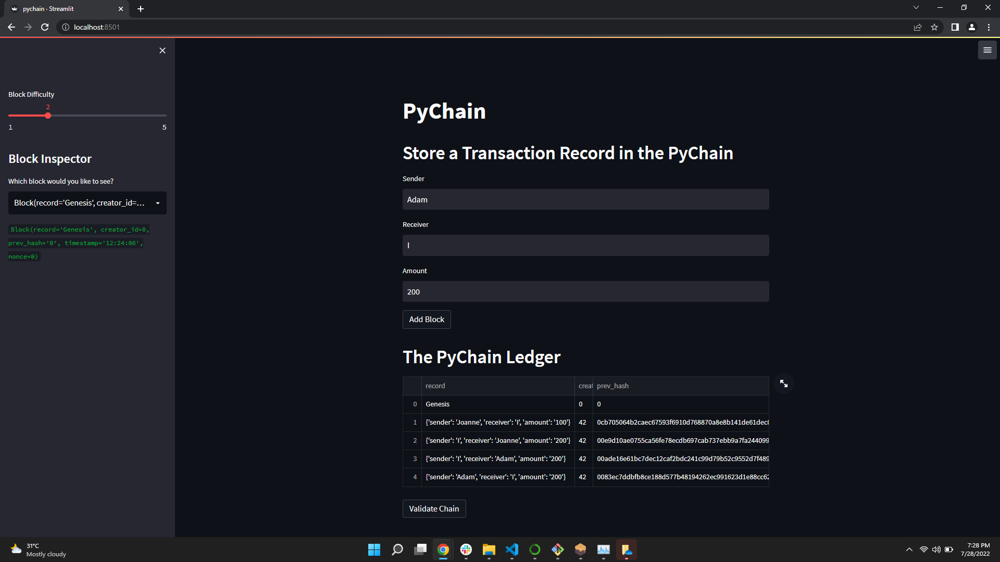
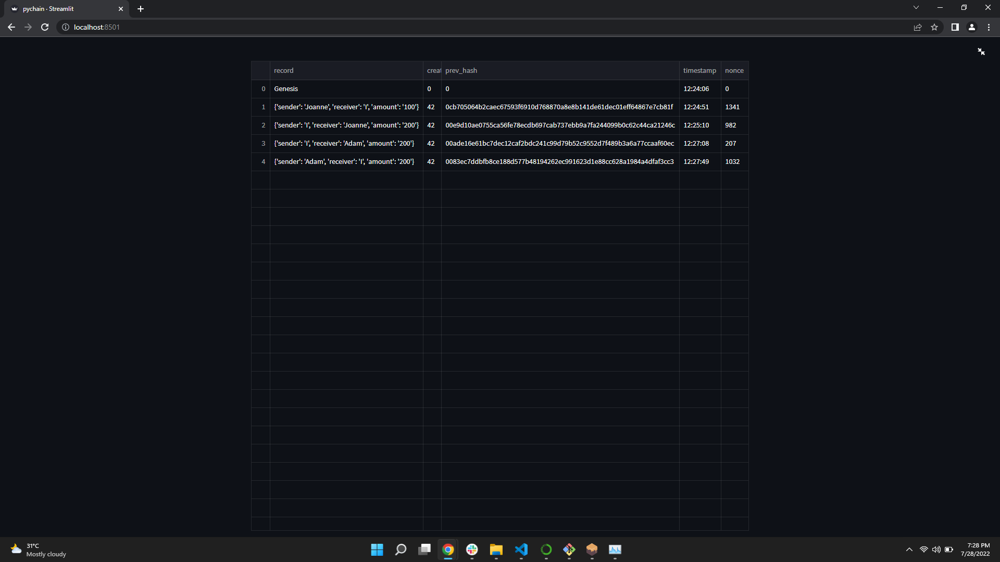

## PyChain Ledger

The steps for this assignment are divided into the following sections:

Create a Record Data Class

Modify the Existing Block Data Class to Store Record Data

Add Relevant User Inputs to the Streamlit Interface

Test the PyChain Ledger by Storing Records

Library used and imported:
Import streamlit as st
from dataclasses import dataclass
from typing import Any, List
import datetime as datetime
import pandas as pd
import hashlib

## Step 1: Create a Record Data Class

1. Define a new class named Record.

2. Add the @dataclass decorator immediately before the Record class definition.

3. Add an attribute named sender of type str.

4. Add an attribute named receiver of type str.

5. Add an attribute named amount of type float.

## Step 2: Modify the Existing Block Data Class to Store Record Data

1. In the Block class, rename the data attribute to record.

2. Set the data type of the record attribute to Record.

refer to *[pychain.py](pychain.py)*

## Step 3: Add Relevant User Inputs to the Streamlit Interface

1. Delete the input_data variable from the Streamlit interface.

2. Add an input area where you can get a value for sender from the user.

3. Add an input area where you can get a value for receiver from the user.

4. Add an input area where you can get a value for amount from the user.

5. As part of the “Add Block” button functionality, update new_block so that Block consists of an attribute named record, which is set equal to a Record that contains the sender, receiver, and amount values. The updated Block should also include the attributes for creator_id and prev_hash.

refer to *[pychain.py](pychain.py)*

## Step 4: Test the PyChain Ledger by Storing Records

